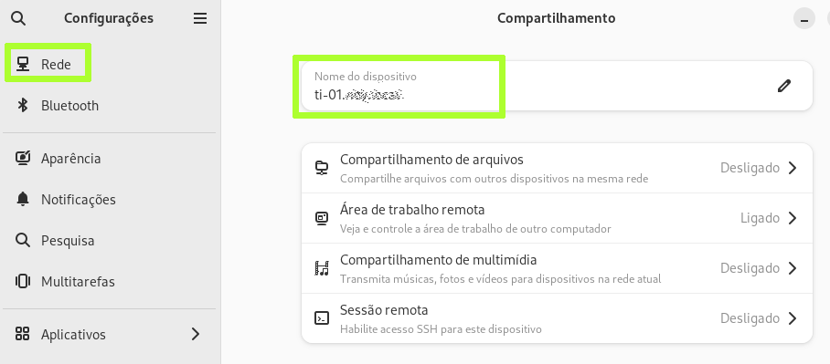
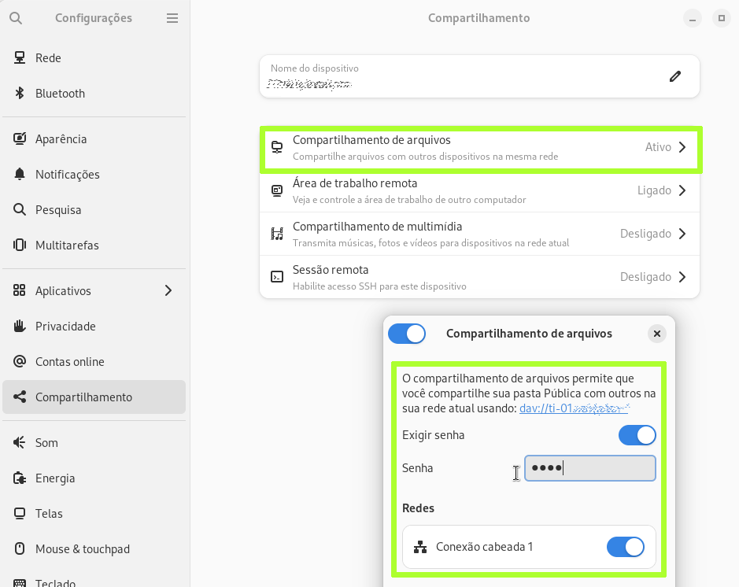
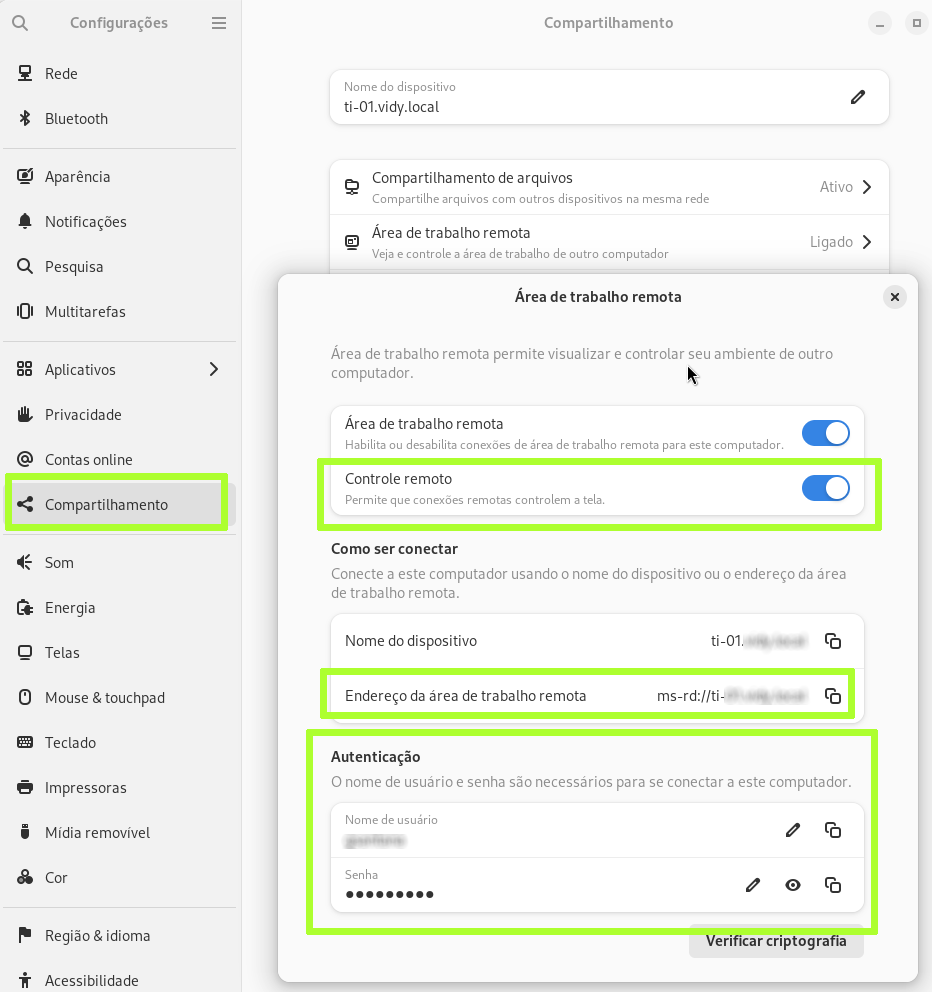
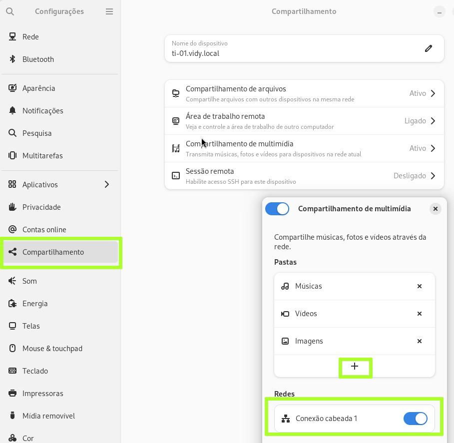
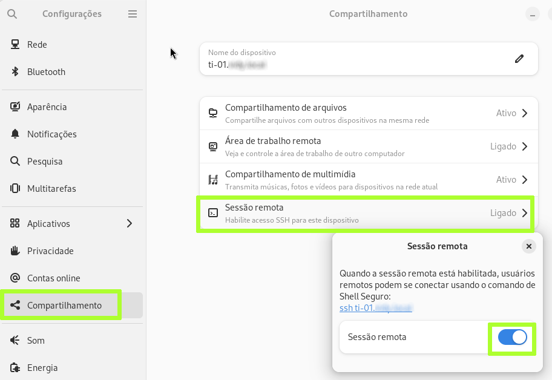

# Instalação do Fedora Linux
Instalação do Fedora Linux

## INSTALAÇÃO

Ao instalar o Linux, escolha não instalar o driver proprietário NVIDIA durante a instalação, no final do processo será instalado o driver nouveau, um driver livre para as placas nVIDIA. Isso foi importante nos últimos dois anos!
Uma consideração especial sobre este driver é que ele é razoavelmente suficiente para resolução 1920x1080(fullhd), porém impraticável em resoluções superiores se sua intenção for aplicar dimensão das frações (125%, 150%, …). Usar fraçõs é muito útil em resoluções 4K onde as letras ficam tão pequenas que é preciso aumentar a dimensão.
Depois que o sistema estiver completamente instalado e após o boot, poderá optar por instalar o driver proprietário. Algo que precisa saber é que o driver proprietário NVIDIA não é compatível com o Wayland, se você quiser usufruir deste servidor gráfico terá de optar pelo driver intel ou noveau.

Serão muitas instruções a seguir, mas vale a pena ir até o final, mas fique ligue para pular as opções que podem não ser necessárias para você. E quando finalmente chegar ao final você será recompensado por não precisar ficar reinstalado o sistema todas as vezes como no Windows e tudo sempre funcionará exatamente como planejado.

O ambiente aqui trata-se dum notebook Acer, no entanto, boa parte deste documento aplica-se a qualquer hardware. Quando for especíco para um hardware, colocarei numa seção especial.

## MUDANDO O NOME DO HOST
Carregue o programa “Configurações”, então procure por “host” ou “compartilhamento” e então encontre a seção “Compartilhamento”. Não queremos no momento ativar o compartilhamento arquivos, mas desejamos apenas modificar o nome do computador por algo que represente melhor o nome do nosso computador que “fedora”:



## HABILITANDO O COMPARTILHAMENTO DE ARQUIVOS 
Ainda no programa “Configurações”, então procure por “host” ou “compartilhamento” e então encontre a seção “Compartilhamento”. Neste momento queremos ativar o compartilhamento arquivos:



Quando precisar acessar arquivos neste computador a partir de outro computador, basta ter acesso ao navegador e indicar a URL que aparece na imagem e digitar a senha que você forneceu. Simples assim.

## HABILITANDO AREA DE TRABALHO REMOTA
Ainda no programa “Configurações”, então procure por “host” ou “compartilhamento” e então encontre a seção “Compartilhamento”. Neste momento queremos ativar o compartilhamento arquivos:



Quando precisar acessar sua estação de trabalho remota você poderá usar aplicativos como o remmina. Bastará fornecer a URL que indica seu computador como mostrado acima em destaque e então fornecer as credenciais fornecidas.

## COMPARTILHAMENTO DE MULTIMEDIA
Ainda no programa “Configurações”, então procure por “host” ou “compartilhamento” e então encontre a seção “Compartilhamento”. Neste momento queremos ativar o compartilhamento de multimedia, que na verdade é uma seção para escolher o que devo compartilhar, enquanto a seção HABILITANDO O COMPARTILHAMENTO DE ARQUIVOS habilita o compartilhamento de arquivos, a seção COMPARTILHAMENTO DE MULTIMEDIA determina o que deve ser compartilhado:



Note na imagem que também é possivel acrescentar outras pastas.
Normalmente, estes compartilhamento são visiveis a partir de outras estações linux e também estações windows. A partir de estações Windows basta chamar como \\computador e os compartilhamentos que houverem no computador serão exibidos.

## HABILITANDO SESSÃO REMOTA
Carregue o programa “Configurações”, então procure por “host” ou “compartilhamento” e então encontre a seção “Compartilhamento”. Queremos no momento ativar o compartilhamento de sessão remota, isto é, permitir que outras pessoas na rede possam abrir uma sessão via ssh ou display grafico (ssh -X) neste computador:



Note que na imagem é mostrado um exemplo de como posso usar o ssh para abrir uma sessão.

## ATUALIZAÇÃO DE REPOSITÓRIO
(todo)

## INSTALANDO PROGRAMAS BASICOS
Estes programas considero essenciais no sistema, são programas utilitários que ajudam a resolver problemas:
```
sudo dnf install -y the_silver_searcher dconf-editor gnome-tweaks 
sudo dnf install -y wget curl tar unzip squashfs-tools
sudo dnf install -y cabextract lzip p7zip p7zip-plugins 
sudo dnf install -y unrar dkms
```

## INSTALANDO PROGRAMAS BASICOS PARA RECOMPILAR
Os pacotes a seguir servem para quem pretende compilar algo no ambiente Linux. Se você pretende instalar o driver proprietário da NVIDIA fornecido pela NVIDIA você também precisará deles:
```
sudo dnf groupinstall "Development Tools" "Development Libraries"
sudo dnf install -y make automake gcc gcc-c++ kernel-devel binutils libX11-devel 
sudo dnf install -y libglvnd-opengl libglvnd-devel pkgconfig
sudo dnf install -y qt5pas qt5pas-devel
sudo dnf install -y wxGTK-devel wxGTK cmake
sudo dnf install -y openal openal-devel
```


## HABILITANDO O DELTA RPM
O Fedora Linux é um comedor de atualizações, depois de instalado ele provavelmente terá mais de 1 GB de atualizações e isso é considerado normal. Mas há um recurso conhecido como deltaRPM que permite fazer as atualizações de maneira mais economica funciona assim, imagine um programa de 100MB, se este programa sofrer uma atualização, ao invés de baixarmos de novo mais 100MB baixaremos apenas um remendo(patch) contendo o que é preciso mudar no programa original para ele ser exatamente igual a versão mais recente. Os patches em geral são pequenos.
As atualizações podem economizar até 80%, mas se isso é bom então porque não é ativado por padrão? Porque perde-se algum tempo aguardando cada patch ser aplicado. Se seu computador for rapido, apliacar um patch pode não ser um problema, mas se seu computador for lento demais compensaria mais esperar pelo download inteiro do que aplicar um patch. Então o deltaRPM é uma troca, em troca de downloads mais rapido você abdica de uma atualização posterior mais lenta - simples assim.
E para habilitar esse recurso no Fedora é bem simples, abra um terminal e instale o pacote "deltarpm":
```
sudo dnf install -y deltarpm 
```
Depois editamos o arquivo /etc/dnf/dnf.conf:
```
sudo nano /etc/dnf/dnf.conf
```
Adicione a seguinte linha:
```
deltarpm=1
```

Na sessão [main] deste arquivo, próximo ao final do arquivo, ficando assim:
[main]
gpgcheck=True  
installonly_limit=3  
clean_requirements_on_remove=True  
best=False  
skip_if_unavailable=True  
**deltarpm=1**  

Salve-o. Depois execute no terminal:
```
sudo dnf update
sudo dnf upgrade
```
As atualizações do fedora são assustadoramente pesadas, prepare-se para uma primeira atualização na casa do 1GB, mas graças ao recurso de deltaRPM esse download até 80% menor, mesma que patches sejam mais lentos, em máquinas novas isso realmente recompensa velocidades de internet menores.

## ATIVE O SUPORTE A FLATPAK CENTRAL
O flatpak está limitado aos repositórios cuja curadoria é do time do Fedora e isto limita a quantidade de programas, se for do seu interesse habilitar o repositório Central do flatpak a quantidade de programas é absurdamente grande. Para hablitá-lo, basta rodar o seguinte comando no terminal:
```
flatpak remote-add --if-not-exists flathub https://flathub.org/repo/flathub.flatpakrepo
```
Feche a sessão e logue-se novamente.

## COMPLETANDO O IDIOMA PORTUGUÊS
O idioma português-brasil não está completamente instalado, para isso execute o programa “system-config-language”, porém ele não está instalado por padrão, execute:
```
sudo dnf install system-config-language
```
e depois finalmente execute “system-config-language”:

Apenas escolha o idioma “Portugues do Brasil” e clique em “OK” e o sistema se certificará que todos os pacotes de idiomas estão instalados.

## PARTIÇÕES NTFS NO SISTEMA
Se utiliza uma partição Windows (NTFS) para gravar seus arquivos e dados a partir do Linux, você pode simplesmente não fazer nada e usar o gerenciador de arquivos do GNOME para entrar e sair do disco NTFS quando quiser. Contudo, se você tem que ir para o terminal e acessá-lo dali então lhe seria conveniente criar uma pasta vazia que ao entrar nela você já observasse o conteúdo dessa partição, se você gostou da idéia então vamos implementá-la:
Identifique qual é o seu disco, execute no terminal:
```
sudo blkid |grep ntfs
/dev/nvme1n1p2: LABEL="Windows" BLOCK_SIZE="512" UUID="389083EB9083AE46" TYPE="ntfs" PARTLABEL="Basic data partition" PARTUUID="f8ff4bca-3ef8-4ba7-b1b1-6e0b00689aab"
/dev/nvme1n1p3: LABEL="DADOS" BLOCK_SIZE="512" UUID="1EB4CCF2B4CCCE09" TYPE="ntfs" PARTLABEL="Basic data partition" PARTUUID="0acfc054-4ac1-46f6-83e3-c90bb5e79f12"
```
No exemplo anterior, o disco desejado tem o LABEL=DADOS e UUID="1EB4CCF2B4CCCE09" , então vamos criar uma pasta vazia, preferencialmente com o nome da label do disco na $HOME ou /media (ou /mnt), ex: /home/usuario/label_dados ou /media/label_dados, a vantagem de ficar em $HOME é que com os cuidados necessários apenas você terá acesso a ela, mas se prefere disponibilizar a partição para todos então tente:
```
sudo mkdir -p /media/label_dados
sudo chmod 1777 /media/label_dados
sudo chmod +s /bin/ntfs-3g
sudo usermod -aG disk $USER 
```

Estamos deixando claro que /media/label_dados estará disponível a todos os usuários. Se escolher criar uma pasta em $HOME, não há a necessidade das linhas acima, apenas criar a pasta vazia.

Execute no terminal:
```
sudo vim /etc/fstab
```
Agora vamos editar o arquivo /etc/fstab e então acrescentar após a última linha:
```
# Minha partição NTFS de label “DADOS”
UUID="1EB4CCF2B4CCCE09" /media/label_dados ntfs-3g windows_names,nosuid,nodev,nofail,rw,user,gid=users,noauto 0 0
```
Explicando os demais parâmetros:
nosuid: Bloqueia a operação de bits suid e sgid
nodev: Não interpreta dispositivos especiais de bloco no sistema de arquivos.
nofail: faz com que o dispositivo seja montado mesmo que tenha sido marcado com erro. Um drive é marcado com ‘erro’ quando o computador é desligado abruptamente ou quando qualquer unidade listada no fstab não está presente ou falhou na montagem.
zero e zero no final da linha: todo


Uma outra forma de escrever essa linha no fstab seria:
```
UUID="1EB4CCF2B4CCCE09" /media/label_dados ntfs nls-utf8,rw,nosuid,nodev,nofail 0 0
```
A diferença é que ao usar driver “ntfs-3g” você estará usando um driver do tipo userspace(pacote ntfs-3g precisa estar instalado) considerado o método mais moderno e seguro, enquanto “ntfs” está ligado a um módulo diretamente no kernel do linux que geralmente recomendamos usar apenas no modo de leitura que impede qualquer gravação na unidade. Mas pode-se habilitar o modo de leitura e escrita se desejar, já testei ambos no modo leitura/escrita e prefiro o “ntfs-3g” que além de ser mais seguro, possui outros parâmetros que nos ajudam a evitar nomes de arquivos que podemos criar usando Linux, mas que o Windows terá problemas com eles, por exemplo o uso de caracteres como  “:” e “?” em nomes de arquivos.

Salve e após o boot, a pasta indicada servirá de acesso a partição NTFS.
Se você não quiser auto montá-la no boot, mas mantê-la apenas quando executar no terminal:
```
mount /media/label_dados
```
Então troque “auto” para “noauto”. O “noauto” é mais seguro por impedir que programas instalados ou scripts maliciosos tenham acesso a esta partição ou disco.
Caso precise reparar a unidade NTFS, execute:
```
sudo ntfsfix /dev/disk/by-uuid/34F84B57F84B1690
```
ou se souber o label do disco:
```
sudo ntfsfix /dev/disk/by-label/DADOS
```
Alternativas: Existe um serviço chamado AutoFS, ele implementa uma solução onde você indica pastas e apenas quando você acessá-las, ele as monta. Serve para discos externos, partições internas e também para compartilhamentos remotos. Esta última, é o motivo pelo qual é mais usado visto que auto-montar pastas que já estão em nosso domínio é mais fácil usando o fstab. AutoFS é um pouco mais complicado que usar /etc/fstab, mas nem tanto depois que você entende como ele funciona. Eu tenho receio de utilizá-lo em ambientes com pouco controle porque se houver programas que vasculhem discos eles irão montar todas as pastas que encontrarem na configuração para auto montar, talvez  voce pense na situação de vírus de computador, mas ocorreria algo similar em softwares de backups que podem erroneamente incluir pastas que não deveriam. Se quiser estudar o AutoFS:

https://devconnected.com/how-to-install-autofs-on-linux/

## HABILITANDO OS ÍCONES DA BANDEJA NO GNOME
O GNOME nas suas últimas opções não vem mais com a bandeja do sistema(tray) e por isso algumas programas que antes usavam ela para ancorar opções podem deixar de funcionar. Para tê-la de volta será necessário instalar extensões do GNOME. Essas extensões na maior parte das vezes são instaladas diretamente do site oficial, mas por algumas serem tão populares também estão nos repositórios e pré-instaladas, então você já tem elas instaladas.
Visite o site(será preciso abrir uma conta):
https://addons.mozilla.org/en-US/firefox/addon/gnome-shell-integration/
Se achar a tela abaixo, então a mesma já está em seu sistema, caso contrário instale-a:


Outra extensão altamente recomendada é essa:
https://extensions.gnome.org/extension/2890/tray-icons-reloaded/
https://extensions.gnome.org/extension/615/appindicator-support/

## BLOQUEIO DE TELA AUTOMÁTICO
O sistema normalmente é ajustado automaticamente para bloquear após 5 minutos de atividade, mas ‘falta de atividade’ é um termo incorreto, o correto seria ‘tempo sem interatividade’, isto é, o tempo que você fica sem ter que interagir com o computador. Às vezes estamos processando algo demorado e temos de esperar ou acompanhar a movimentação de log de status e o computador durante este tempo estará tendo muito trabalho, porém com pouca interatividade a tela será bloqueada. Então precisamos saber quanto tempo precisamos nas tarefas do dia a dia ou então desligá-la.

Vá em configurações->Privacidade->Tela de bloqueio:


E ajuste o tempo desejado, ou até mesmo desligue-o se isso for preciso.


## AJUSTANDO O PROMPT NO TERMINAL
(todo)


## INTEGRAÇÃO DO GNOME SHELL COM O FIREFOX
As integrações dos navegadores com o ambiente GNOME é permitida através de extensões, com elas instaladas você pode fazer mudanças no ambiente gnome shell como alterar o papel de parede do gnome ao visitar a página gnome-look.org ou instalar extensões em extensions.gnome.org. 
Instale a extensão para o Firefox:
https://addons.mozilla.org/pt-BR/firefox/addon/gnome-shell-integration/


## ALGUMAS EXTENSÕES ÚTEIS
As extensões a seguir lhe serão úteis
```
sudo dnf install -y gnome-extensions-app gnome-tweaks
~sudo dnf install -y gnome-shell-extension-appindicator~
```

## PARA TREINAMENTO
Para criar material de treinamento que incluirá vídeo é sugerível instalar a seguinte extensão Draw On Your Screen cuja instrução para instalação se encontra em:
https://codeberg.org/som/DrawOnYourScreen

```
git clone https://codeberg.org/som/DrawOnYourScreen --depth=1 --single-branch --branch face ~/.local/share/gnome-shell/extensions/draw-on-your-screen@som.codeberg.org
```
Depois vá até .local/share/gnome-shell/extensions e abra o arquivo metadata.json e adicione "41" e então reinicie o gnome-shell.


## GNOME DASH TO DOCK
O GNOME não possui uma dock, isto é, um local para repousar os aplicativos favoritos ou atualmente carregados. O time do GNOME espera que você use o botão super ou ALT+TAB para listá-los ou carregá-los de seu painel de programas. Porém, muitos estão acostumados a uma dock, se você é uma delas então instale a extensão dash to dock:

https://extensions.gnome.org/extension/307/dash-to-dock/


## HABILITANDO OS ÍCONES DA BANDEJA NO GNOME
Outra extensão altamente recomendada é essa:
https://extensions.gnome.org/extension/2890/tray-icons-reloaded/
https://extensions.gnome.org/extension/615/appindi	cator-support/


## GERENCIANDO A CLIPBOARD
(todo)


## GNOME-TWEAKS
(todo)


## INSTALAÇÃO DE FONTES DE CARACTERES ADICIONAIS
Vamos adicionar um repositório que nos será util para acrescentar mais fontes ao sistema:
```
sudo dnf install -y curl cabextract xorg-x11-font-utils fontconfig
sudo rpm -i https://downloads.sourceforge.net/project/mscorefonts2/rpms/msttcore-fonts-installer-2.6-1.noarch.rpm
```
O pacote instalado acima complementará as fontes microsoft de que alguns programas portados do Windows talvez precisem.

A fonte ‘fonts-roboto’ é bastante interessante para uso em terminal e IDEs de programação:
sudo dnf install -y google-roboto-fonts google-roboto-condensed-fonts google-roboto-mono-fonts google-roboto-slab-fonts

A fonte Hack é bastante apropriada para ser usada para listar codigo fonte de programas ou utilizar o terminal, sua instalação pelo repositório é simples:
```
sudo dnf copr enable zawertun/hack-fonts
sudo dnf install -y hack-fonts
```
Mas recomendo sua instalação manual, pois se instalada em $HOME a mesma poderá ser reaproveitada em futuras reinstalações, visite a página:
https://github.com/source-foundry/Hack
e siga as instruções, a saber:
```
cd /tmp
wget -vc https://github.com/source-foundry/Hack/releases/download/v3.003/Hack-v3.003-ttf.zip
unzip Hack-v3.003-ttf.zip -d ~/.local/share/fonts/
fc-cache -f -v
```
Para conferir se a fonte foi realmente instalada, executamos:
```
fc-list | grep "Hack"
```
Se aparecer o nome da fonte em ~/.local/share/fonts/ttf/Hack-BoldItalic.ttf: Hack:style=Bold Italic e assim por diante é porque a fonte foi instalada com sucesso.


## Fonte "CONSOLAS"
A fonte “consolas” é uma interessante fonte para ser usada tanto em desenvolvimento e aplicativos como também no ambiente gráfico. Ela é de propriedade de terceiros e por isso não vem acompanhada dentro das distribuições Linux, mas é possível instalá-las. Para instalar siga as instruções:
```
cd /tmp
wget -O /tmp/YaHei.Consolas.1.12.zip https://storage.googleapis.com/google-code-archive-downloads/v2/code.google.com/uigroupcode/YaHei.Consolas.1.12.zip
unzip YaHei.Consolas.1.12.zip -d ~/.local/share/fonts/ 
fc-cache -f -v
fc-list | grep "Consolas"
```


## EXTENSÕES DO GNOME SHELL
Extensões do GNOME SHELL acrescentam funcionalidades ou mudam comportamento. A partir do GNOME 41 muitas extensões listadas abaixo deixaram de funcionar, mas deixo elas listadas porque em algum momento poderão voltar a funcionar. Alguns são considerados necessários, outros opcionais e ainda outros são bem específicos. Coloquei aqui algumas que considero necessários e opcionais.
Extensões necessárias:
Para áudio (escolha apenas uma):
~https://extensions.gnome.org/exten sion/906/sound-output-device-chooser/~
**Outras**
https://extensions.gnome.org/extension/19/user-themes/
https://extensions.gnome.org/extension/36/lock-keys/
https://extensions.gnome.org/extension/779/clipboard-indicator/
https://extensions.gnome.org/extension/1460/vitals/
https://extensions.gnome.org/extension/3902/eye-and-mouse-extended/

**Outras que são opcionalmente úteis:**
https://extensions.gnome.org/extension/690/easyscreencast/
https://extensions.gnome.org/extension/945/cpu-power-manager/ (testar melhor)
https://extensions.gnome.org/extension/750/openweather/
https://extensions.gnome.org/extension/1238/time/

IMPORTANTE: Se por acaso alguma extensão se comportar mal, use o programa  “gnome-extensions-app” para removê-la ou configurá-la de forma diferente.


## USANDO O THEMAS VARIADOS DO GNOME SHELL
O GNome Shell usa um conjunto de critérios para focar no que você está fazendo e evitar distrações, mas nada disso adianta se não nos comprometermos em saber como as coisas funcionam. Por isso recomendo que leiam e vejam os vídeos contidos na página:
https://material-shell.com/

Se você usa muito o computador, recomendo que dê atenção às teclas de atalho:
https://material-shell.com/#hotkeys

## USANDO O TERMINAIS VIRTUAIS DO GNOME SHELL
Quem vem do ambiente Windows parece odiar o GNOME justamente porque é muito diferente do Windows, afinal cadê o minimizar, maximizar, painel inferior, menu iniciar, bandeja, etc… porém, se você se habituar a utilizar algumas janelas lado a lado ou sempre maximizados então terá de se acostumar a alguns atalhos:

Super+Shift+PageDown[PageUp] para descer[ou sumir] a aplicação para a workspace abaixo[ou acima]
Super+PageDown[PageUp] para descer ou subir entre as workspaces
Super+AWSD permite movimentar-se entre as áreas virtuais. AWSD podem ser substituídas pelas setas, quem usa notebook com teclados que combinam as setas com Fn ficará mais à vontade em usar AWSD.
Não uso tanto, mas são poucos conhecidos.
Print Screen copia a tela inteira e grava-a na pasta Imagens
Alt+Print Screen copia a janela do aplicativo que estiver ativo grava-o na pasta Imagens
Shft+Print Screen permite selecionar a área que deseja gravar e  grava-o na pasta Imagens


## INSTALAR O GOOGLE CHROME
Apesar do Firefox ser um excelente navegador, muitas vezes precisaremos do Google Chrome, para baixá-lo use a loja de software (Programas) e procure por “Google Chrome” e instale-o.


## INTEGRAÇÃO DO GNOME SHELL COM O CHROMIUM 
As integrações dos navegadores com o ambiente GNOME é permitida através de extensões, com elas instaladas você pode fazer mudanças no ambiente gnome shell como alterar o papel de parede do gnome ao visitar a página gnome-look.org ou instalar extensões em extensions.gnome.org. 
Também aplica-se a variações, incluindo o Google Chrome, execute no terminal:
```
sudo dnf install chrome-gnome-shell
```
## Visual Studio Code (repositório e instalação)

Para instalar visite:
https://code.visualstudio.com/docs/setup/linux

E siga as instruções, mas basicamente é:

Para acrescentar o repositório oficial do VS Code:
```
sudo rpm --import https://packages.microsoft.com/keys/microsoft.asc
sudo sh -c 'echo -e "[code]\nname=Visual Studio Code\nbaseurl=https://packages.microsoft.com/yumrepos/vscode\nenabled=1\ngpgcheck=1\ngpgkey=https://packages.microsoft.com/keys/microsoft.asc" > /etc/yum.repos.d/vscode.repo'
sudo dnf check-update
sudo dnf install -y code
```
Relata-se um problema ao sincronizar configurações e extensões com o vscode:
**“Visual Studio Code is unable to watch for file changes in this large workspace” (error ENOSPC)**
Na internet encontrei o seguinte workaround que resolve tal problema:
```
sudo -i
echo 'fs.inotify.max_user_watches = 524288' >> /etc/sysctl.conf
sysctl -p
```
Se esta for sua primeira instalação visite novamente a página:
https://code.visualstudio.com/download

Nessa página há uma seção intitulada ‘Top Extensions’, guie-se por ela para instalar os plugins mais efetivos para cada linguagem que for utilizar.


## ZOOM CLOUD MEETINGS
Para baixá-lo use a loja de software (Programas) e procure por “Zoom” e instale-o.

## IMPRESSORA PDF
(todo)

## INSTALANDO A IMPRESSORA EPSON L355 LOCALIZADA NA REDE
(todo)

## INSTALANDO O SCANNER EPSON L355
(todo)


## INSTALANDO O LEITOR OCR
(todo)


## CRIANDO ATALHOS PARA PROGRAMAS CONHECIDOS
(todo)


## AUTO-CARREGAR PROGRAMAS NO INICIO DA SESSÃO
(todo)


## LIBERANDO PORTAS NO FIREWALL
Get a list of allowed ports in the current zone:
```
$ firewall-cmd --list-ports
```
Add a port to the allowed ports to open it for incoming traffic:
```
$ sudo firewall-cmd --add-port=port-number/port-type
```
Make the new settings persistent:
```
$ sudo firewall-cmd --runtime-to-permanent
```


## VIRTUALBOX
O VirtualBox é essencial para o pleno funcionamento do ambiente de desenvolvimento para instalar, precisaremos incluir o repositório oficial do Vitualbox. O virtualbox pode ser obtido diretamente no site:
https://www.virtualbox.org/
Sua instalação é simples, basta baixar o arquivo com a extensão .rpm e dar duplo clique nele.
Também é necessário abaixar “VirtualBox Oracle VM VirtualBox Extension Pack” que entrega alguns recursos extras.


## LEITOR DE CERTIFICADO DIGITAL
Cada leitor e modelo pode ter instruções diferentes, é melhor procurar um howto na internet apropriado.


## MICROSOFT OFFICE (web apps)

Visite a página a seguir usando um navegador Google Chrome(ou compatível com webapps):
office.com 
E autentique-se com uma conta live da Microsoft.
Estando na home da página vá no menu do navegador


## INSTALANDO O GIMP
Vá no app  Software e procure por GIMP no repositório do ‘Flathub’:

Clique nas propriedades dele e encontrará alguns plugins(complementos) que também poderá instalar, são eles:

BIMP - Realizar operações em batch com vários arquivos
https://www.youtube.com/watch?v=CaeTkgPNkkg

FocusBlur - Capacidade de efeito de profundidade
https://www.youtube.com/watch?v=u-YB-KipWzk

Gimp transformação Fourier
Técnica para remover ou manipular padrões em fotos, geralmente as antigas
https://www.youtube.com/watch?v=se9I3uGITR0

Gimp Lens Fans
Aplicar e corrigir efeitos por lentes
https://www.youtube.com/watch?v=FQGDgBT1tWk

G’MIC
GRAYC’s Efeitos
https://www.youtube.com/watch?v=kZnEpkNsDK0
https://www.youtube.com/watch?v=VOPHbSgJUSI

LiquidRescale
Permite remover um elemento e redimensionar uma imagem como se o elemento nunca estivesse existido.
https://www.youtube.com/watch?v=hhFVWKJA76U

Resynthesizer
Retire manchas ou outros defeitos de imagens
https://www.youtube.com/watch?v=n76owcpShqw

## ESPELHAMENTO DE CELULAR
Usaremos um programa chama scrcpy, para instalar executamos:
```
sudo dnf install -y adb android-tools 
sudo dnf install -y scrcpy scrcpy-server
```
Para usá-lo terá de ativar o modo de depuração de seu celular ou tablet:
https://developer.android.com/studio/command-line/adb#Enabling
E em alguns aparelhos também:
https://github.com/Genymobile/scrcpy/issues/70#issuecomment-373286323

Existe também uma GUI que para alguns simplifica algumas operações, faça a instalação a partir da loja de aplicativos:
```
guiscrcpy
```


## USANDO O CELULAR COMO WEBCAM
Instruções: https://www.dev47apps.com/droidcam/linux/

No celular Android instale o app DroidCam.
No terminal, execute:
```
sudo dnf install -y adb android-tools
cd /tmp
wget https://files.dev47apps.net/linux/droidcam_latest.zip
unzip droidcam_latest.zip -d droidcam
cd droidcam
sudo ./install-client
```
E prossiga com a instalação, para acionar a parte de vídeo:
```
sudo ./install-video
```
E prossiga com a instalação, para acionar a parte de áudio:
```
sudo ./install-sound
```
E prossiga com a instalação.
Para ter acesso a webcam, execute no terminal droidcam ou droidcam-cli, haverá as opções de usar o celular como webcam plugado na USB ou via Wifi. Para criar um atalho no ambiente GNOME:
```
gnome-text-editor ~/.local/share/applications/droidcam.desktop
```
e então colar:
```
[Desktop Entry]
Version=1.0
Type=Application
Terminal=false
Name=DroidCam
Exec=droidcam
Comment=Use seu celular Android como uma Webcam wireless/USB ou como IP Cam!
Icon=droidcam
Categories=GNOME;GTK;Video;
Name[it]=droidcam
```
Salve e feche o arquivo e a partir de agora encontrará o ícone do DroidCam no seu sistema.

## OBS STUDIO
Este é o melhor programa de studio e studio de streaming. É incrível acreditar que é opensource e extremamente profissional. Para instalar basta ir na loja e escolher OBS Studio.


## MINDER
Este é o melhor programa para mapas mentais no formato que roda no modo desktop. Ele é muito similar ao femi. Para instalar:
```
flatpak install --user https://flathub.org/repo/appstream/com.github.phase1geo.minder.flatpakref
flatpak --user update com.github.phase1geo.minder
```
ou se preferir pelo repositório do Ubuntu:
```
sudo apt install minder
```


## HYPNOTIX
Este é o melhor programa de iptv. Ótimo para assistir TVs que são transmitidas via tv. Para instalar:
```
wget https://github.com/linuxmint/hypnotix/releases/download/1.1/hypnotix_1.1_all.deb
sudo dpkg -i hypnotix_1.1_all.deb
sudo apt -f install
```
Algumas fontes de TVs podem estar irregulares, então acaso não queira assistir TVs então poderá desinstalar o programa com o comando:
```
sudo apt remove hypnotix*
```

## GIT
Vamos ajustar nosso ambiente com o GIT com os comandos:
git config --global user.name "Gladiston Santana"
git config --global user.email "gladiston.santana@gmail.com"


Recentemente, o github fez alterações em seu sistema onde a instrução:
git config credential.helper 'cache --timeout=28800' 
Será ignorada completamente ou terminará em erro e a tentativa de login resultará neste erro:
**Fatal Authentication Failed for: site.com.br**

Para solucionar o problema, precisará instalar e configurar o ‘Git Credential Manager’ (GCM):
```
sudo dnf install -y seahorse
sudo dnf install -y git-credential-libsecret
```
Após, o git só precisará dessa configuração adicional:
```
git config --global credential.helper /usr/libexec/git-core/git-credential-libsecret
```
Agora, você precisa saber que o método de autenticação mudou, você não usa mais o “username+ senha” do seu usuario git, mas “username+token”. O token é criado na página do github, no menu de sua profile->Settings->Developer settings->Personal access tokens->Tokens(classic) e então criar um token. Este token será o substituto de sua senha git no terminal.


## INSYNC
Este é o melhor programa cliente de Google Drive, ele simula uma unidade de drive local e comumente é usado para colocar backups no Google Drive sem a necessidade do browser. Para instalar é simples e complicado, simples porque você só tem que dar dois cliques no arquivo e complicado porque se trata dum software proprietário que por não poder ser auditado você terá de confiar no fornecedor. Se você deseja prosseguir assim mesmo então visite a página:
https://www.insynchq.com/downloads

E baixe o instalador e depois dê dois cliques sobre o arquivo baixado e o processo de instalação se iniciará. Se você deseja instalar a partir do repositório, no link acima eles fornecem instruções para serem executados no terminal e você terá atualizações do insink como qualquer outro programa advindo dos repositórios oficiais, neste caso, oficiais do publicador do insink.


## BLANKET
Programa para exibir sons no ambiente de fundo, geralmente usado para focar no trabalho, com sons ambiente da natureza ou urbanos como de uma cafeteria. Para instalar basta ir na loja e escolhê-lo pelo nome Blanket.


## HOMESERVER
Este programa serve para compartilhar uma ou varias pastas de uma forma simples, voce inicia o programa, indica as pastas a serem compartilhadas e momentaneamente eles estarão disponíveis para os computadores na mesma rede local através do navegador. Para instalar basta ir na loja e escolhê-lo pelo nome homeserver.

Quando os clientes copiarem o que queriam, você fecha o aplicativo e o compartilhamento estará encerrado ou pode encerrar pasta a pasta.
Observação: Geralmente se você habilitou o compartilhamento de arquivos, talvez não precise do HOMESERVER.


## TIMESHIFT
Este programa serve para backups, especialmente backups incrementais. Para instalar:
```
sudo dnf install -y  timeshift
```
É melhor procurar no youtube em como utilizá-lo:
https://www.youtube.com/watch?v=tQY5IHOnK9E
Dá para recuperar tanto arquivos quanto o sistema operacional.


## HANDBRAKE
HandBrake é um dos mais poderosos conversores de vídeo. Para instalar basta ir na loja e escolhê-lo pelo nome handbrake.


## FormatLab
FormatLab é um dos mais promissores conversores de vídeo após o HandBrake. Ele faz as mesmas atividades do handbrake, porém é mais simples de operar. Para instalar basta ir na loja e escolhê-lo pelo nome FormatLab.


## GPARTED
GParted é um particionador gráfico para Linux, com ele podemos criar e manipular partições de discos que tenham os mais diversos sistemas operacionais. Muito intuitivo e fácil, torna operações complexas bem mais simples e por isso é importante ter muita cautela. Ele tem um método onde você planeja o que vai fazer, varias tarefas seguidamente mas só o aplica quando você confirmar. Isso é importante porque antes de você executar o procedimento você poderá cancelar a operação, pode parecer simples, mas a maioria dos particionados fazem apenas um passo de cada vez e não tem volta, então o gparted é muito eficiente e fácil. Para instalar basta ir na loja e escolhê-lo pelo nome gparted.


## BLENDER
Blender, também conhecido como blender3d, é um programa de código aberto, desenvolvido pela Blender Foundation, para modelagem, animação, texturização, composição, renderização, e edição de vídeo.  Para instalar basta ir na loja e escolhê-lo pelo nome blender. Se você não cria animações, ignore a instalação desse programa.

## VidCutter
(analogo ao vidcoder para windows)

http://bluegriffon.org/


## INKSCAPE
Para instalar basta ir na loja e escolhê-lo pelo nome INKSCAPE.


## OUTROS TÓPICOS INTERESSANTES
* Virtualização
* Instalando o banco de dados FirebirdSQL
* Ambiente de programação FreePascal/Lazarus
* Ambiente de programação JAVA
* Ambiente de programação Python
* Versionamento com o asdf


